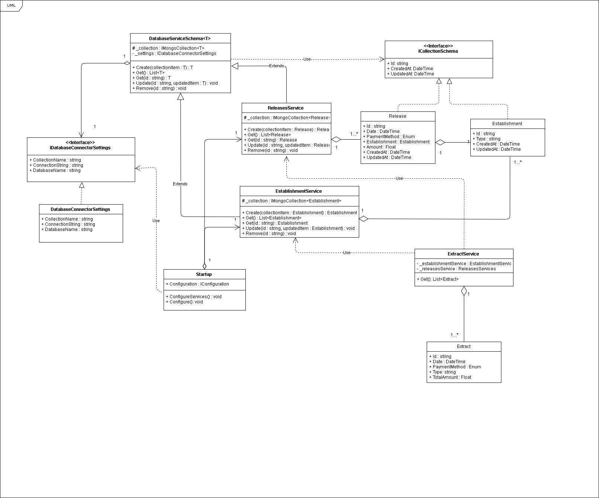

<html>
    <head>
    </head>
    <body>
        <h1>Desafio Extratos de Lançamentos</h1>
        <h2>- Badges</h2>
        

            
            
            
            
        

        <h2 vspace=5px>- Diagrama de Classes (version 1.0)</h2>
        

            
        

    </body>
</html>
