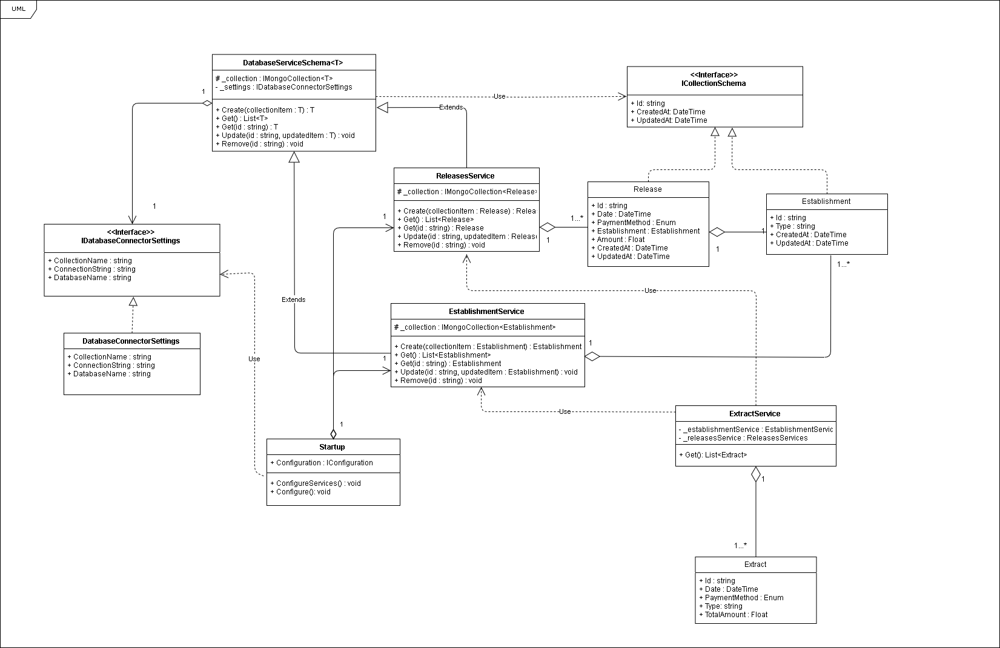

<html>
    <head>
    </head>
    <body>
        <h1>Desafio Extratos de Lançamentos</h1>
        <h2>- Badges</h2>
        

            
            
            
            
        

        <h2 vspace=5px>- Considerações Gerais</h2>
        <ul>
            <li>A consolidação dos resultados da API e o teste de carga podem ser acessados <a href="https://extratos-resultados-app.herokuapp.com/">aqui</a>;</li>
            <li>Os nomes das APIs na documentação são respectivamente: Establishments (Estabelecimentos), Releases (Lançamentos) e Statements (Extratos). O idioma inglês foi escolhido para a construção dado que evita problemas com acentuação;</li>
            <li>O diagrama de classe da próxima seção foi elaborado no ínicio do projeto como base para a construção das APIs, mas não corresponde ao resultado final;</li>
            <li>Para organização das tarefas de trabalho foi utilizado o Pivotal Tracker;</li>
            <li>Os exemplos das requisições realizadas estão na collection do Postman no diretório <a href="./public">public</a> e também podem ser acessados no SwaggerUI;</li>
            <li>O banco de dados utilizado foi o MongoDB através do Atlas;</li>
            <li>O limite da conta utilizada no Atlas é de 80 conexões simultâneas, de forma que pode impactar os resultados do teste de estresse;</li>
            <li>As badges descrevem as ferramentas utilizadas para fluxo de integração contínua e entrega (CI e CD);</li>
            <li>A API está hospedada em um container Docker no Heroku e documentada com Swagger. <a href="https://extratos-api.herokuapp.com/swagger/index.html">Acesse aqui</a> ou clique na badge do Heroku do topo do README;</li>
            <li>A integração contínua está sendo realizada pelo TravisCI. Para mais detalhes do pipeline de build e testes clique na badge do TravisCI;</li>
            <li>A cobertura de testes está sendo realizada pelo Coveralls.IO, com mais de 70% das linhas de código dos controllers verificadas. Os casos de testes estão no projeto dentro do diretório 'tests'. Para mais detalhes da cobertura clique na badge do Coveralls;</li>
            <li>A qualidade do código está sendo realizada pelo CodeClimate. Para mais detalhes da qualidade do código clique na badge do CodeClimate;</li>
        </ul>
        <h2 vspace=5px>- Considerações em relação a construção da API</h2>
        <ul>
            <li>A API está estruturada em 3 controllers;</li>
            <li>Toda API está estruturada com a idéia de assíncronia de requisições para evitar bloqueios de thread;</li>
            <li>O banco de dados possui 2 Schemas base Releases (Lançamentos) e Establishments (Estabelecimentos);</li>
            <li>Os extratos (Statements) são gerados da associação dos outros 2 Schemas, ou seja, não é armazenado no banco;</li>
            <li>O Schema de Lançamentos (Release) possui chave estrangeira para o Schema de  estabelecimentos (Establishment);</li>
            <li>Método de Pagamento (Payment Method) é um enum com os valores Crédito e Débito;</li>
            <li>Valores monetários são obrigatoriamente Decimal, com escala de 2 pontos flutuantes;</li>
            <li>O atributo Name dos Estabelecimentos é tratado com Unique e chave dos relacionmentos com os outros Schemas;</li>
            <li>O atributo Classificação dos Estabelecimentos é chamado Type e é do tipo string. Decidi usar string ao invés de enum para dar mais liberdade ao usuário e flexibilidade aos Schemas para futuras classificações;</li>
            <li>Os testes unitários foram feitos utilizando o XUnit;</li>
            <li>A validações de entrada foram feitas com o FluentValidation e algumas validações personalizadas nos controllers;</li>
        </ul>
        <h2 vspace=5px>- Diagrama de Classes (version 1.0)</h2>
        

            
        

        <h2 vspace=5px>- Stories : Pivotal Tracker</h2>
        

            
O Projeto foi organizado através do modelo Kanban com a ferramenta Pivotal Tracker

            <a href="https://www.pivotaltracker.com/n/projects/2417244"><cite>-> Link do Projeto</cite></a>
            <a href="./public/stories/desafioextratos_stories.csv">
-> Stories em formato CSV
</a>
        

        <h2 vspace=5px>- Teste de Stress</h2>
        <ol>
            <li>Acesse os resultados em: <a href="https://extratos-resultados-app.herokuapp.com/">https://extratos-resultados-app.herokuapp.com/</a>;</li>
            <li>Clique no item Stress Test da barra de navegação;</li>
            <li>Clique em iniciar teste e aguarde até o final das requisições (dura aproximadamente 60s para leitura e escrita);</li>
        </ol>
        
O teste de estresse é realizado pelo pacote Artillery para o node.js que simula requisições em paralelo de múltiplos clientes. O teste de estresse ocorre em um período de 10s com 30 requisições novas a cada segundo. No final são realizadas 300 requisições em um espaço de 10 segundos. O sumário dos resultados estão dispostos na aplicação e o JSON completo também está disponível.

    </body>
</html>
